<!-- Cinematic intro animation -->

<!-- Hero banner -->

<!-- Terminal -->

  <a href="#_"></a>

<!-- ======================= ABOUT ======================= -->

  <a href="#_"></a>

<!-- ======================= OVERVIEW ======================= -->

  <a href="#_"></a>

  <a href="#_"></a>
  <a href="#_"></a>
  <a href="#_"></a>

<!-- Impact -->

<!-- ======================= CAPABILITIES ======================= -->

  <a href="#_"></a>

<!-- ======================= PROJECTS ======================= -->

  <a href="#_"></a>

  <a href="https://github.com/yagyeshVyas/personalforge"></a>
  <a href="https://github.com/yagyeshVyas/VibeGuard"></a>

  <a href="https://github.com/yagyeshVyas/AI-Career-Suite"></a>
  <a href="https://github.com/yagyeshVyas/linkedin-scraper">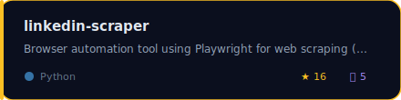</a>

<!-- VibeGuard spotlight -->

<!-- ======================= WORK WITH ME ======================= -->

  

  <a href="https://github.com/yagyeshVyas"></a>
  &nbsp;&nbsp;
  <a href="https://linkedin.com/in/yagyeshvyas"></a>
  &nbsp;&nbsp;
  <a href="https://www.npmjs.com/~yagyeshvyas"></a>

  

<!-- Animated wave footer -->

Built with care, not templates. Every pixel hand-coded SVG.

