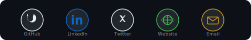

<!-- Banner -->

<!-- Terminal -->

  

---

<!-- Live stats — custom dark theme matching the design system -->

  
  
  

<!-- Contribution heatmap -->

  

<!-- Tech stack -->

  

---

### Build log

- **personalforge** — Offline AI from any documents. LoRA fine-tuning + RAG + GGUF export. No API keys, runs 100% local.
- **VibeGuard** — Security scanner for AI-generated apps. 699 rules, 76 MCP tools, 13-layer defense. Zero-trust sandbox.
- **AI-Career-Suite** — AI resume analyzer powered by OpenRouter + Streamlit.

 

  
<b>Pinned repos</b>

   
  

    
    
    
    
  

  
<b>Trophies & activity</b>

   
  

    
      
    
  

  
<b>Contribution snake</b>

   
  

    
  

  
Auto-regenerates daily via GitHub Action

 

<!-- Social -->

  

 

  

Built with care, not templates.

